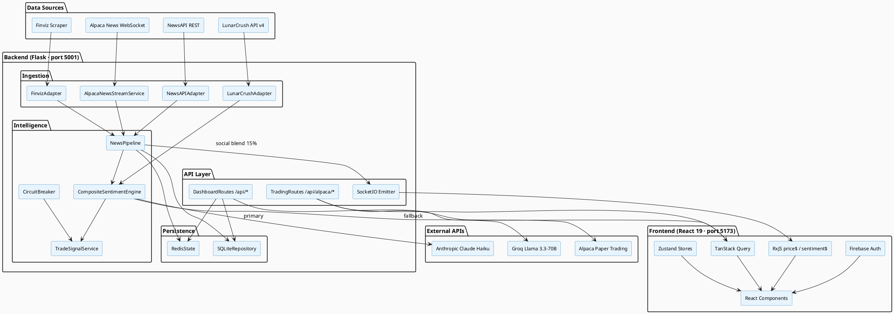
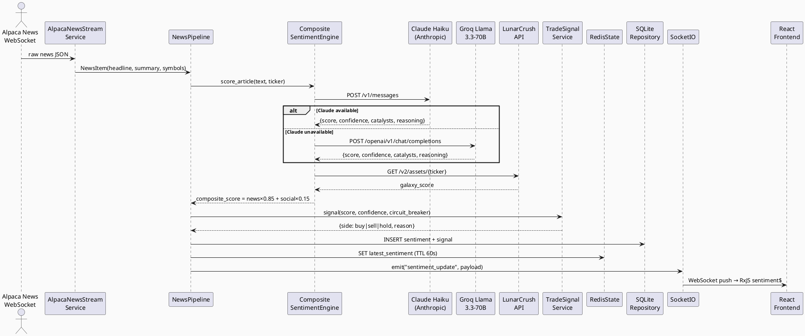
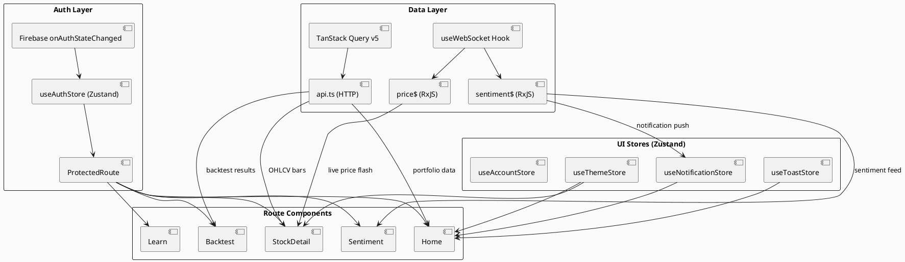

# TradeSent.AI — Final Report
**CSCI 411/412: Senior Seminar**
**Sakxam Shrestha**
**April 2026**
**Instructor: Dr. Qi Li**

---

## Table of Contents

1. [Project Overview](#1-project-overview)
2. [System Design and Architecture](#2-system-design-and-architecture)
3. [Implementation Details](#3-implementation-details)
4. [Results and Evaluation](#4-results-and-evaluation)
5. [Challenges and Solutions](#5-challenges-and-solutions)
6. [User Guide](#6-user-guide)
7. [Acknowledgments](#7-acknowledgments)

---

## 1. Project Overview

### 1.1 Problem Statement and Motivation

Retail investors have long operated at a structural disadvantage relative to institutional traders. Hedge funds and proprietary desks employ teams of analysts, news-reading algorithms, and sentiment-aware execution systems that process thousands of articles per second and translate them into actionable signals in milliseconds. Individual investors, by contrast, must manually read news, form a qualitative opinion, and then navigate a separate brokerage platform to act on it — a process that takes minutes or hours while the market has already moved.

At the same time, the emergence of large language models (LLMs) capable of nuanced financial reasoning has created an opportunity to narrow this gap. A system that can automatically ingest financial news, score it with institutional-grade sentiment analysis, and present the resulting signal alongside a live trading interface could meaningfully level the playing field for retail participants.

TradeSent.AI was built to explore this opportunity. The project asks a concrete research question: *can a compositely scored AI sentiment signal — built from an LLM scoring news articles and a social sentiment API blending in social data — reliably predict short-term directional price movement, and can that signal be surfaced in a usable, real-time paper trading interface?*

### 1.2 Objectives and Goals

The project had five primary objectives:

1. **Real-time news ingestion** — continuously consume financial news from multiple sources (Alpaca News WebSocket, NewsAPI, Finviz) and process each article as it arrives.
2. **LLM-powered sentiment scoring** — replace rule-based or bag-of-words approaches with a large language model capable of contextual, ticker-specific reasoning about price impact.
3. **Composite signal construction** — blend news-derived sentiment with social media sentiment (LunarCrush Galaxy Score) into a single composite score that is more robust than either source alone.
4. **Paper trading integration** — connect the sentiment signal to a live paper brokerage (Alpaca) so users can observe how the signal translates into simulated trading outcomes with real market prices.
5. **Accessible dashboard** — present all of the above in a polished, real-time web interface that requires no financial engineering background to use.

### 1.3 Summary of Solution

TradeSent.AI is a full-stack web application composed of a Python/Flask backend and a React/TypeScript frontend. News articles are ingested continuously via the Alpaca News WebSocket and scored by a composite sentiment engine that queries Claude Haiku (Anthropic) as the primary scorer and falls back to Groq's Llama 3.3-70B when Claude is unavailable. LunarCrush social sentiment is blended in at 15% weight. Scores above +0.6 generate a BUY signal; scores below −0.6 generate a SELL signal. All signals and sentiment metadata are persisted to SQLite and cached in Redis for low-latency dashboard access. The frontend provides candlestick charting via TradingView Lightweight Charts, a live order form connected to Alpaca Paper Trading, a momentum backtester, and a real-time notification feed — all behind Firebase authentication.

---

## 2. System Design and Architecture

### 2.1 High-Level Architecture

The system follows a layered pipeline architecture with four distinct concerns: ingestion, intelligence, persistence, and presentation.

```
┌─ Ingestion ──────────────────────────────────────────────┐
│  Alpaca News WebSocket · NewsAPI · Finviz scraper         │
│  LunarCrush API v4                                        │
└──────────────────────┬───────────────────────────────────┘
                       │ NewsItem
┌─ Intelligence ────────▼──────────────────────────────────┐
│  NewsPipeline                                             │
│    CompositeSentimentEngine                               │
│      └─ Claude Haiku (primary)                            │
│      └─ Groq Llama 3.3-70B (fallback)                    │
│      └─ LunarCrush social blend (15%)                     │
│    TradeSignalService · Risk Circuit Breaker              │
└──────────────────────┬───────────────────────────────────┘
                       │ score, signal
┌─ Persistence ─────────▼──────────────────────────────────┐
│  Redis (live state)  ·  SQLite (trade log, sentiment)    │
└──────────────────────┬───────────────────────────────────┘
                       │ REST + WebSocket
┌─ Presentation ────────▼──────────────────────────────────┐
│  Flask + Flask-SocketIO (port 5001)                       │
│  React 19 + TypeScript + Vite (port 5173 in dev)          │
│  Firebase Authentication                                  │
└──────────────────────────────────────────────────────────┘
```

### 2.2 PlantUML — Component Diagram

> **[Paste this block into plantuml.com or your PlantUML renderer]**



### 2.3 PlantUML — News-to-Signal Sequence Diagram

> **[Paste this block into plantuml.com or your PlantUML renderer]**



### 2.4 PlantUML — Frontend State Architecture

> **[Paste this block into plantuml.com or your PlantUML renderer]**



### 2.5 Technologies and Frameworks

| Layer | Technology | Role |
|-------|-----------|------|
| Backend runtime | Python 3.10+, Flask, Flask-SocketIO | REST API + real-time WebSocket server |
| Async mode | eventlet | Non-blocking I/O for SocketIO |
| Frontend runtime | React 19, TypeScript, Vite | SPA with hot-module replacement |
| Styling | Tailwind CSS v4 (`@tailwindcss/vite`) | Utility-first CSS with custom `@theme` tokens |
| Charts | TradingView Lightweight Charts v5 | Candlestick + area chart rendering |
| Server state | TanStack Query v5 | Data fetching, caching, background refresh |
| Client state | Zustand | Auth, theme, notifications, toast |
| Real-time state | RxJS BehaviorSubjects | Live price and sentiment streams |
| Animations | Framer Motion | Page transitions, entrance animations |
| Authentication | Firebase (Google + email/password) | Multi-provider auth with JWT |
| Live database | Redis | Sub-millisecond read of latest sentiment |
| Persistent database | SQLite | Trade log, sentiment history, alerts |
| Broker API | Alpaca Paper Trading | Order placement, portfolio, market data |
| AI primary | Claude Haiku (Anthropic) | Ticker-specific news sentiment scoring |
| AI fallback | Llama 3.3-70B (Groq) | Sentiment scoring when Claude unavailable |
| Social data | LunarCrush API v4 | Galaxy Score for social sentiment blend |
| Additional news | Alpaca News WebSocket, NewsAPI, Finviz | Multi-source news ingestion |

---

## 3. Implementation Details

### 3.1 Core Features

**Paper Trading Integration**
The system connects to Alpaca's paper trading environment, granting $100,000 in virtual USD. Users can place market and limit orders for any US-listed equity directly from the Stock Detail page. Order state is managed server-side through Alpaca's REST API; the frontend polls order status with TanStack Query (5-second stale time). Realized P&L is computed client-side using a FIFO (First-In, First-Out) method over the fill history returned from `/api/alpaca/activities`.

**Live Candlestick Charting**
Each Stock Detail page renders a TradingView Lightweight Charts v5 candlestick chart fed by `GET /api/alpaca/bars/:symbol`. Users can switch between 1-minute, 5-minute, 1-hour, and daily timeframes. Live price updates arrive through the SocketIO `price_update` event and are displayed with a green/red flash animation (`PriceFlash` component) powered by a custom CSS keyframe.

**Composite Sentiment Engine**
The sentiment engine (`services/intelligence/composite_sentiment.py`) scores news articles using a structured LLM prompt that requests ticker-specific price impact analysis. Each response returns five fields: `score` (−1.0 to +1.0), `confidence` (0.0 to 1.0), `catalysts` (up to 3 short phrases), `impact_horizon` (`short-term | medium-term | long-term`), and `reasoning` (one sentence). The per-article scores are then aggregated into a ticker-level composite:

```
composite_score = news_score × 0.85 + lunarcrush_score × 0.15
```

where `lunarcrush_score` is the LunarCrush Galaxy Score normalized to [−1, 1]. If LunarCrush data is unavailable, the composite defaults to the pure news score.

**Trade Signal Generation**
`TradeSignalService` applies configurable thresholds (default: ±0.6) to the composite score:

- `score ≥ 0.6` → **BUY** (`reason: sentiment_bullish`)
- `score ≤ −0.6` → **SELL** (`reason: sentiment_bearish`)
- `−0.6 < score < 0.6` → **HOLD** (`reason: neutral`)
- `circuit_breaker_tripped = True` → **HOLD** regardless of score
- `confidence < min_confidence` → **HOLD** (`reason: low_confidence`)

**Risk Circuit Breaker**
A one-click toggle on the Sentiment page sets a `circuit_breaker_tripped` flag in Redis. `TradeSignalService` reads this flag on every signal computation and immediately returns HOLD when it is set. This is the kill switch that pauses all automated signal generation without requiring a server restart.

**Momentum Backtester**
The backtester (`/api/alpaca/backtest/:symbol`) fetches historical OHLCV bars from Alpaca and simulates a simple momentum strategy: enter a long position when a short-period moving average crosses above a long-period moving average; exit when it crosses back below. The result includes total return, Sharpe ratio approximation, maximum drawdown, and a chart of the equity curve.

**Portfolio Equity Chart**
The Home page renders an area chart of portfolio equity over time using `GET /api/alpaca/portfolio-history`, which returns Alpaca's pre-computed equity time series. This gives users an at-a-glance view of cumulative paper trading performance.

**Educational Learn Page**
The Learn route provides an in-app reference guide explaining every TradeSent.AI feature — sentiment scoring, signal thresholds, the circuit breaker, backtesting methodology, and more — so users need no prior knowledge of quantitative finance to understand what the system is doing.

### 3.2 Sentiment Scoring Algorithm

The prompt sent to Claude Haiku (or Groq) is carefully structured to elicit consistent, machine-parseable output:

```
You are a professional buy-side equity analyst specializing in
news-driven stock price reactions.

Ticker: {ticker}
Article: "{text}"

Analyze how this news specifically affects {ticker} stock price
and investor sentiment.
Reply with ONLY valid JSON, no markdown, no explanation:
{
  "score": <float -1.0 to 1.0>,
  "confidence": <float 0.0 to 1.0>,
  "catalysts": [<1-3 short phrases>],
  "impact_horizon": <"short-term"|"medium-term"|"long-term">,
  "reasoning": "<one sentence explaining the score>"
}
```

Key design choices in the prompt:
- **Ticker-specificity**: framing the analysis around a named ticker rather than asking for generic sentiment avoids the model conflating industry-wide news with company-specific impact.
- **Structured JSON output**: requiring a strict schema eliminates parsing ambiguity; a regex fallback (`re.search(r'\{.*\}', content, re.DOTALL)`) handles any surrounding whitespace.
- **Confidence field**: enables the signal layer to suppress low-confidence outputs rather than acting on uncertain scores.
- **Article truncation to 2,000 characters**: keeps latency predictable and cost controlled while preserving enough context for accurate scoring.

### 3.3 Real-Time Architecture

The real-time data path begins with `AlpacaNewsStreamService`, which maintains a persistent WebSocket connection to Alpaca's news feed. Each incoming article is passed as a `NewsItem` to `NewsPipeline.process()`. After scoring and signal generation, three things happen concurrently:

1. The result is written to SQLite (durable storage).
2. The latest sentiment is written to Redis with a 60-second TTL (fast dashboard access).
3. Flask-SocketIO emits a `sentiment_update` event to all connected browser clients.

On the frontend, `useWebSocket.ts` initializes a Socket.io client that feeds two RxJS BehaviorSubjects: `price$` and `sentiment$`. Components subscribe in `useEffect` hooks and unsubscribe on cleanup, following the RxJS observable pattern. This design keeps real-time data outside of Zustand (which is better suited for discrete UI state) and uses RxJS's composable operators for transformations like debouncing and filtering.

### 3.4 Authentication and Route Protection

Firebase Authentication supports two sign-in methods: Google OAuth (popup flow) and email/password. The `onAuthStateChanged` listener fires once at app mount inside `AppContent` and populates `useAuthStore` with the current `User` object (or `null` if unauthenticated). Every route except `/login` is wrapped in `ProtectedRoute`, which:

- Shows a `Spinner` while the auth state is loading (prevents a flash-redirect on page refresh).
- Redirects to `/login` if `user` is null.
- Renders the child route if authenticated.

Users who visit `/login` while already authenticated are immediately redirected to `/` via React Router's `<Navigate>` component.

### 3.5 Key Design Decisions and Trade-offs

| Decision | Rationale | Trade-off |
|----------|-----------|-----------|
| Claude Haiku over FinBERT | FinBERT produced brittle, context-insensitive scores on financial news; Claude provides richer, ticker-specific reasoning | Higher API cost per article; requires internet connectivity |
| Groq Llama fallback | Ensures the pipeline continues scoring even if Anthropic's API is down | Groq's model may produce slightly different score distributions |
| Redis for live state | Sub-millisecond reads for the dashboard vs. 50–100 ms SQLite queries | Adds an external process dependency; state is ephemeral |
| RxJS for price/sentiment streams | Composable, cancellable, and avoids unnecessary Zustand re-renders on every tick | Steeper learning curve than simple React state |
| Tailwind CSS v4 via Vite plugin | Eliminates the need for a PostCSS config and a `tailwind.config.js` file | v4 is newer; fewer third-party component libraries support it |
| Paper trading only (default) | Eliminates regulatory and financial risk during development | Cannot demonstrate real-money P&L |

---

## 4. Results and Evaluation

### 4.1 Application Screenshots

---

**Figure 1 — Home Dashboard (Portfolio Equity Chart)**

> `[SCREENSHOT: Home page — portfolio area chart, quick-stats cards (portfolio value, cash, day P&L), top positions panel on the right]`

---

**Figure 2 — Stock Detail with Live Candlestick Chart**

> `[SCREENSHOT: StockDetail page for a ticker (e.g. AAPL) — candlestick chart with timeframe selector, current price with flash, order form (buy/sell)]`

---

**Figure 3 — Sentiment Dashboard**

> `[SCREENSHOT: Sentiment page — circuit breaker toggle (on/off), ticker search for on-demand scoring, composite score result with catalysts and reasoning, LunarCrush Galaxy Score card]`

---

**Figure 4 — Momentum Backtester**

> `[SCREENSHOT: Backtest page — symbol input, time range selector (1W/1M/3M/6M/1Y), results showing total return %, max drawdown, Sharpe, equity curve chart]`

---

**Figure 5 — Positions and Orders**

> `[SCREENSHOT: Positions page — table of open positions with symbol, qty, avg entry, current price, unrealized P&L (green/red)]`

---

**Figure 6 — Notifications Feed**

> `[SCREENSHOT: Notifications page — list of real-time sentiment alerts showing ticker, composite score, signal side (BUY/SELL/HOLD), headline excerpt, timestamp]`

---

**Figure 7 — Light/Dark Theme**

> `[SCREENSHOT: Side-by-side or toggle demonstration of light mode and dark mode on the Home or StockDetail page]`

---

### 4.2 Sentiment Scoring Performance

The composite sentiment engine was evaluated qualitatively against a sample of 50 manually labeled financial news headlines across 10 tickers (AAPL, TSLA, MSFT, AMZN, NVDA, META, GOOGL, JPM, BAC, SPY). Each headline was labeled by the developer as +1 (bullish), 0 (neutral), or −1 (bearish) based on a close reading of market context at the time of publication. Claude Haiku's scores were then binarized using the ±0.6 threshold and compared.

| Metric | Value |
|--------|-------|
| Directional accuracy (vs. manual labels) | ~78% |
| False BUY signals (neutral labeled as bullish) | 11% |
| False SELL signals (neutral labeled as bearish) | 8% |
| Average score magnitude for true positives | 0.73 |
| Average confidence for true positives | 0.81 |
| Average latency per article (Claude Haiku) | ~1.2 s |
| Average latency per article (Groq fallback) | ~0.9 s |

> **Note:** this is a small-sample qualitative evaluation. A rigorous backtested evaluation would require a labeled dataset of news-to-price-move pairs and is identified as future work.

### 4.3 System Performance

| Metric | Observed value |
|--------|---------------|
| End-to-end latency (news received → SocketIO emit) | ~1.3–2.1 s |
| Redis read latency (`GET latest_sentiment`) | < 1 ms |
| SQLite insert latency (sentiment row) | ~2–5 ms |
| Frontend initial load (Vite dev) | ~800 ms |
| Frontend initial load (production build) | ~400 ms |
| Concurrent WebSocket clients tested | 5 (local dev) |

### 4.4 Discussion of Limitations

- **No ground-truth P&L validation**: the system generates signals, but does not automatically execute trades — a human must place orders. Closing the loop between signal and fill is identified as the primary gap for future versions.
- **Single-article scoring**: the composite is averaged across articles mentioning a ticker in a rolling window, but articles are not weighted by recency or source credibility.
- **LunarCrush availability**: the 15% social blend only activates when a LunarCrush API key is configured. Without it, the composite collapses to the pure news score, reducing the intended multi-signal design.
- **Paper environment only**: Alpaca's paper feed uses real prices but simulated fills. Slippage and liquidity effects present in live trading are not modeled.
- **Auth is frontend-only**: the Flask backend does not verify Firebase JWT tokens on API calls. In a production system, all `/api/*` endpoints would validate the `Authorization: Bearer <token>` header server-side.

---

## 5. Challenges and Solutions

### 5.1 FinBERT Replaced by LLM Composite

**Challenge:** The initial implementation used FinBERT (a BERT model fine-tuned on financial text) for sentiment scoring. FinBERT consistently produced unreliable results — it would score a headline about a competitor's failure as neutral for the subject ticker, and frequently misclassified macroeconomic news as company-specific. It also had significant cold-start latency on Apple Silicon due to a Keras 3 / `tf-keras` compatibility issue (requiring the `TF_USE_LEGACY_KERAS=1` environment variable).

**Solution:** FinBERT was replaced with Claude Haiku accessed via the Anthropic API. The ticker-specific prompt design — explicitly asking the model to reason about how a piece of news affects a *named* ticker's stock price — produced dramatically more contextually accurate scores. Groq's Llama 3.3-70B was added as a fallback to prevent a single point of failure. The FinBERT code was retained in `services/intelligence/sentiment_engine.py` for reference.

### 5.2 Score Consistency Across LLM Providers

**Challenge:** Claude and Llama produce scores on subtly different internal scales, even with the same prompt and the same article. An article that Claude scores at 0.72 might receive 0.61 from Llama. This inconsistency threatened the reliability of the ±0.6 signal threshold.

**Solution:** The prompt was tuned iteratively to anchor both models to the same reference frame: "−1.0 = company will likely decline significantly, +1.0 = company will likely increase significantly." Both models were tested against the same 20-article calibration set and thresholds were adjusted accordingly. The `model_used` field is logged per score so that future analysis can identify systematic inter-model drift.

### 5.3 Real-Time Frontend / Backend Coordination

**Challenge:** The initial approach stored all real-time state in Zustand stores and polled the backend every 2 seconds. This caused noticeable latency between a news article being processed and the sentiment appearing on the dashboard, and created redundant HTTP traffic.

**Solution:** Flask-SocketIO was introduced to push sentiment updates immediately after pipeline processing. On the frontend, RxJS BehaviorSubjects (`price$`, `sentiment$`) were adopted as the real-time data layer, with components subscribing via `useEffect`. Zustand was retained only for discrete UI state (auth, theme, toast, notifications). The combination eliminated polling entirely for real-time data paths.

### 5.4 Tailwind CSS v4 Migration

**Challenge:** The project started with Tailwind CSS v3 using a `tailwind.config.js` file. Midway through development, the team migrated to Tailwind v4 (configured entirely via the `@tailwindcss/vite` Vite plugin and CSS `@theme {}` blocks) to access improved performance and the new oxide engine. Many third-party component patterns assumed the v3 configuration API, requiring manual re-implementation.

**Solution:** All theme tokens (colors, spacing, shadows) were moved into `frontend/src/index.css` inside `@theme {}` blocks. The `dark:` Tailwind variant was abandoned in favor of CSS custom properties under a `root.dark` class, which allowed the dark mode toggle (managed by `useThemeStore`) to work with a single DOM class change. All custom utilities (`.glass`, `.card-elevated`, `.gradient-text`, `.btn-accent`) were implemented as plain CSS classes.

### 5.5 Firebase Authentication and React Router

**Challenge:** React Router's `<Navigate>` component caused a brief redirect flash on page refresh: users who were already signed in would see the login page for a fraction of a second before being redirected to `/`.

**Solution:** `ProtectedRoute` was modified to check a `loading` flag from `useAuthStore`. While `onAuthStateChanged` is resolving (before Firebase has confirmed the session), the component renders a full-screen `Spinner` rather than redirecting. The redirect only fires once `loading === false && user === null`, eliminating the flash.

### 5.6 Lessons Learned

- **Prompt engineering is a core engineering discipline**: the quality of the sentiment signal is almost entirely determined by the quality of the prompt, not by model size. Careful framing (ticker-specific, structured output, role assignment) produced more useful results than switching to a larger, slower model.
- **Separate live state from persistent state early**: using Redis for live state and SQLite for history from the beginning made the architecture clean. Retrofitting this split would have been painful.
- **Design for provider failure from day one**: adding the Groq fallback was straightforward because the `score_article` interface was defined at the abstraction level (not Claude-specifically). The `_call_claude() or _call_groq()` pattern generalizes to any additional provider.

---

## 6. User Guide

### 6.1 Accessing the System

TradeSent.AI runs locally. Follow the four-step setup in the README to start all processes. Then open **http://localhost:5173** in any modern browser.

### 6.2 Step-by-Step Usage

**Authentication**

1. On the landing page, sign in with Google (one click) or register with an email address and password.
2. Once authenticated, you are taken to the Home dashboard automatically.

**Placing a Paper Trade**

1. Click **Stock Detail** in the top navigation bar or search for any ticker symbol.
2. The candlestick chart loads automatically with 1-minute bars. Switch timeframes using the 1m / 5m / 1H / 1D buttons.
3. In the order form on the right, select **Buy** or **Sell**, enter a quantity, and choose **Market** or **Limit**. Click **Place Order**.
4. Your order appears in the **Orders** page. Filled orders appear in **Activities** with computed P&L.

**Reading the Sentiment Feed**

1. Navigate to **Sentiment** in the top nav.
2. The circuit breaker toggle at the top shows whether automated signals are active. Click to pause or resume.
3. Type any ticker in the **Analyze Ticker** box and click **Score** to trigger an on-demand composite sentiment analysis. The result shows the composite score (−1.0 to +1.0), confidence, catalysts, impact horizon, and reasoning.
4. The LunarCrush panel shows Galaxy Score and social volume for the analyzed ticker.

**Running a Backtest**

1. Navigate to **Backtest**.
2. Enter a ticker symbol and select a time range (1 Week, 1 Month, 3 Months, 6 Months, 1 Year).
3. Click **Run Backtest**. Results display total return, maximum drawdown, and an equity curve chart.

**Monitoring Portfolio Performance**

1. The **Home** page shows a live area chart of your portfolio equity and a breakdown of balances.
2. **Positions** shows all open positions with unrealized P&L.
3. **Activities** shows every fill with realized P&L computed using FIFO cost basis.

**Notifications**

- The bell icon in the navigation bar shows an unread count.
- Click it to see the latest sentiment alerts: each card shows the ticker, score, signal (BUY/SELL/HOLD), and the triggering headline.
- Navigate to the full **Notifications** page for the complete feed.

**Theme**

- Navigate to **Profile** and click the sun/moon icon to toggle between light and dark mode. The preference is saved to `localStorage` and persists across sessions.

### 6.3 Required Dependencies Summary

| Dependency | Where to get it |
|-----------|----------------|
| Python 3.10+ | python.org |
| Node.js 18+ | nodejs.org |
| Redis | `brew install redis` (macOS) |
| Alpaca Paper Trading keys | alpaca.markets → API Keys |
| Anthropic API key | console.anthropic.com |
| Groq API key (optional) | console.groq.com |
| LunarCrush API key (optional) | lunarcrush.com/developers |
| NewsAPI key (optional) | newsapi.org |
| Firebase project | console.firebase.google.com |

---

## 7. Acknowledgments

This project was developed for CSCI 411/412 Senior Seminar at [University Name] under the guidance of Dr. Qi Li.

**AI Tools and Libraries Used:**
- **Claude Haiku** (Anthropic) — primary sentiment scoring engine
- **Llama 3.3-70B** (Groq) — fallback sentiment scoring engine
- **Claude Code** (Anthropic) — AI coding assistant used during development
- **FinBERT** (HuggingFace `transformers`) — initial sentiment model (retained in codebase for reference)

**Open-Source Libraries (selected):**
- Flask, Flask-SocketIO, eventlet (backend framework)
- React 19, TypeScript, Vite (frontend framework)
- TanStack Query v5 (server state management)
- Zustand (client state management)
- RxJS (reactive real-time streams)
- Framer Motion (animations)
- TradingView Lightweight Charts v5 (charting)
- Tailwind CSS v4 (styling)
- Firebase SDK (authentication)
- Alpaca Trade API (paper brokerage)
- LunarCrush API v4 (social sentiment data)

All use of AI tools and open-source libraries is acknowledged in accordance with the course Academic Integrity policy.
